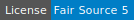
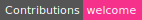
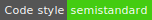

# Peerhaven web app

- [What is Peerhaven?](https://github.com/peerhaven/peerhaven#readme)
- [Setup](SETUP.md)
- [FAQ](FAQ.md)
- [Guide for contributors](CONTRIBUTING.md)
- [Security policy](https://github.com/peerhaven/peerhaven/blob/master/SECURITY.md)
- [Changelog](CHANGELOG.md)
- [Colophon](https://github.com/peerhaven/peerhaven/blob/master/COLOPHON.md)

## License

- Peerhaven (i.e. its software / source code) is licensed under [Fair Source 5 (v0.9)](https://fair.io/)
- Documentation and media are licensed under [Creative Commons Attribution 4.0 International](https://creativecommons.org/licenses/by/4.0/)
- For questions / discussion, refer to this issue:
  [peerhaven/peerhaven#1 Pick a license](https://github.com/peerhaven/peerhaven/issues/1)
